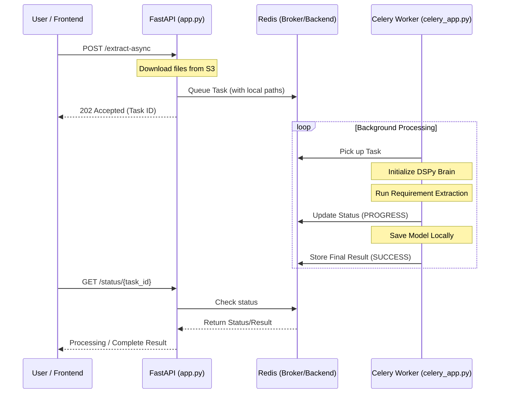

# Architecture Documentation: Celery & Redis Integration

This document explains how the asynchronous background processing is implemented in the **Prism** project using Celery and Redis.

## 1. System Overview

The integration moves heavy-duty AI tasks (like PDF text extraction and DSPy training) out of the main API request loop. This ensures the API remains responsive and doesn't time out during large processing jobs.

### Component Roles
*   **FastAPI (App)**: Receives user requests, manages job submission, and provides status updates.
*   **Redis (Broker)**: A high-performance message queue that stores job details waiting to be processed.
*   **Celery Worker**: A background process that picks up jobs from Redis, executes the AI logic, and saves the results.
*   **Redis (Backend)**: Stores the final result and status of the task so the API can fetch it later.

---

## 2. Working Workflow (Diagram)

---

## 3. Implementation Details

### How Redis was implemented:
1.  **Installation**: Installed via Homebrew (`brew install redis`) for local development.
2.  **Service**: Runs as a background daemon (`brew services start redis`) on port `6379`.
3.  **Logical DBs**: We use DB `0` for the Broker (the message queue) and DB `1` for the Result Backend (storing final JSON outputs).

### How Celery was implemented:
1.  **celery_app.py**: A new module that initializes the Celery instance.
2.  **Environment Sync**: It uses `.env` to load the Broker and Backend URLs, making it easy to swap local Redis for AWS ElastiCache.
3.  **Task Definition**: The `extract_requirements_task` captures all logic from `extract_requirements.py`.
4.  **Path Handling**: The worker uses explicit `sys.path` insertion to ensure it can find all project modules regardless of where it's launched.

### Why this is a good integration:
*   **Reliability**: If a PDF is 100 pages long, the API won't disconnect the user.
*   **Scalability**: You can increase processing speed simply by starting more workers (Concurrency).
*   **Fault Tolerance**: If a task fails, Celery can be configured to retry it automatically.
*   **Decoupling**: The API doesn't need to know *how* the extraction works; it just needs to know it's "Done".

---

## 4. Maintenance Commands

| Action | Command |
| :--- | :--- |
| **Start Redis** | `brew services start redis` |
| **Start Worker** | `celery -A celery_app worker --loglevel=info` |
| **Clear Queue** | `redis-cli flushall` |
| **Monitor UI** | `celery -A celery_app flower` |
| **Check Redis** | `redis-cli ping` (should return PONG) |
